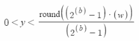
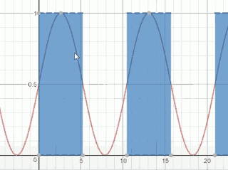
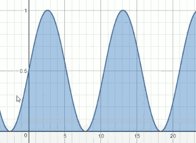
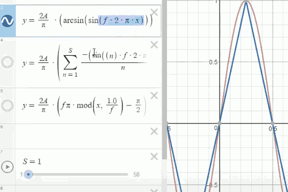
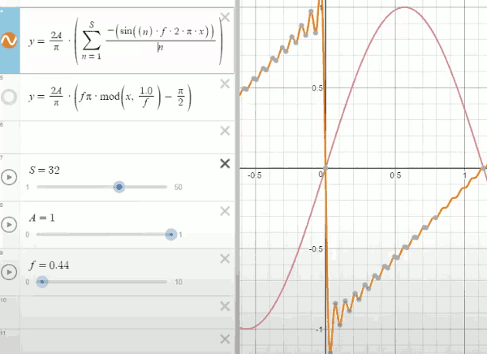
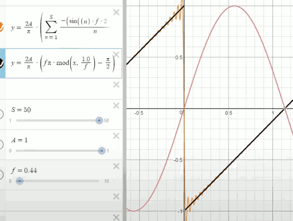
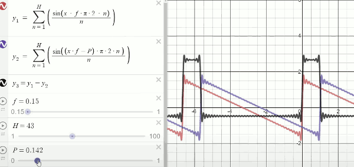

```
w = A·sin(fx) + A 

0 <= w <= 2A
```

A is amplitude

low f is bass ,   high f is treble.


We need to represent the wave form as smoothly as possible.

The compute can only store numbers digitally to a fixed amount of precision. We can use a seconde function to do it.




- b = 1
    - 
- b = 8
    - 
    - we now have 256 levels to represent the sine wave

As we apply more bits to represent the sine wave , the approximation of the sine wave becomes more and more accurate.

----

samplerate , the 44100, is really used to store the accuracy of the frequency.  We need a samplerate which is double the highest frequency we want to record. 

The human hearing range is about 20Hz to 20kHz,  so 44100 is little bit more than double 20k Hz, which means we should be able to in the most extreme cases capture with some accuracy 20k Hz signal. 

---

every douling in frequency moves you up 1 octave.

---

If you have really large amplitudes and very low frequencies, you could easily damage your speakers or headphones. 


- How to generate triangle wave?
    - 

- How to generate saw wave ?
    - 
    - however anding up sine waves in this manner is grossly inefficient for a computer so we can also apply a hack to this using a mod function to simulate the addition of all of the sine waves, to give us a perfect piecewise linear approximation. 
    - 


**Square Pulse Wave**

the ratio of the low pulse and hight pulse , is called the **duty cycle**.  This adds texture to the sound.

- How to generate square pulse wave ?
    1. create 2 saw wave y1,y2
    2. shift the phase of y2
    3. subtract  y = y1-y2
    4. changing the phase (P) will cause different duty cycle.
        - 
        - it does have a little bit of DC offset, but in audio that's not very important. It's only the change that matters that's what we hear coming out of the speakers. 
        - 送给声卡的声音数据是无符号数据，如果是8bit数据， 只要完整的波形是在 0~255 之间，Y轴上的偏移对声音并不会有影响
        - 注意: 这里的算法，产生的波形，振幅会达到 超过 ±3

---

- Changing frequency is going to sound terrible. That is because changing frequency of a playing waveform actually requires a little bit more sophistication. 


